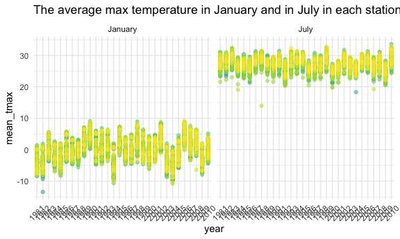
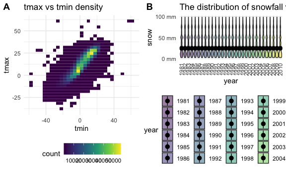

Homework 3
================
Zhongqi Yue

## Problem 1

``` r
data("instacart")
```

This dataset contains 1384617 rows and … columns.

Observations are the level of items in orders by user. There are user /
order variables – user ID, order ID, order day, and order hour. There
are also item variables – name, aisle, department, and some numeric
codes.

How many aisles, and which are most items from?

``` r
instacart %>% 
    count(aisle) %>% 
    arrange(desc(n))
```

    ## # A tibble: 134 x 2
    ##    aisle                              n
    ##    <chr>                          <int>
    ##  1 fresh vegetables              150609
    ##  2 fresh fruits                  150473
    ##  3 packaged vegetables fruits     78493
    ##  4 yogurt                         55240
    ##  5 packaged cheese                41699
    ##  6 water seltzer sparkling water  36617
    ##  7 milk                           32644
    ##  8 chips pretzels                 31269
    ##  9 soy lactosefree                26240
    ## 10 bread                          23635
    ## # … with 124 more rows

Let’s make a plot

``` r
instacart %>% 
    count(aisle) %>% 
    filter(n > 10000) %>% 
    mutate(
        aisle = factor(aisle),
        aisle = fct_reorder(aisle, n)
    ) %>% 
    ggplot(aes(x = aisle, y = n)) + 
    geom_point() + 
    theme(axis.text.x = element_text(angle = 90, vjust = 0.5, hjust = 1))
```


Let’s make a table\!\!

``` r
instacart %>% 
    filter(aisle %in% c("baking ingredients", "dog food care", "packaged vegetables fruits")) %>% 
    group_by(aisle) %>% 
    count(product_name) %>% 
    mutate(rank = min_rank(desc(n))) %>% 
    filter(rank < 4) %>% 
    arrange(aisle, rank) %>% 
    knitr::kable()
```

| aisle                      | product\_name                                 |    n | rank |
| :------------------------- | :-------------------------------------------- | ---: | ---: |
| baking ingredients         | Light Brown Sugar                             |  499 |    1 |
| baking ingredients         | Pure Baking Soda                              |  387 |    2 |
| baking ingredients         | Cane Sugar                                    |  336 |    3 |
| dog food care              | Snack Sticks Chicken & Rice Recipe Dog Treats |   30 |    1 |
| dog food care              | Organix Chicken & Brown Rice Recipe           |   28 |    2 |
| dog food care              | Small Dog Biscuits                            |   26 |    3 |
| packaged vegetables fruits | Organic Baby Spinach                          | 9784 |    1 |
| packaged vegetables fruits | Organic Raspberries                           | 5546 |    2 |
| packaged vegetables fruits | Organic Blueberries                           | 4966 |    3 |

Apples vs ice cream..

``` r
instacart %>% 
    filter(product_name %in% c("Pink Lady Apples", "Coffee Ice Cream")) %>% 
    group_by(product_name, order_dow) %>% 
    summarize(mean_hour = mean(order_hour_of_day)) %>% 
    pivot_wider(
        names_from = order_dow,
        values_from = mean_hour
    )
```

    ## `summarise()` regrouping output by 'product_name' (override with `.groups` argument)

    ## # A tibble: 2 x 8
    ## # Groups:   product_name [2]
    ##   product_name       `0`   `1`   `2`   `3`   `4`   `5`   `6`
    ##   <chr>            <dbl> <dbl> <dbl> <dbl> <dbl> <dbl> <dbl>
    ## 1 Coffee Ice Cream  13.8  14.3  15.4  15.3  15.2  12.3  13.8
    ## 2 Pink Lady Apples  13.4  11.4  11.7  14.2  11.6  12.8  11.9

## Problem 2

Load, tidy, and otherwise wrangle the data.

``` r
accel_df= (
  read.csv("./data/accel_data.csv")%>% 
  janitor::clean_names() %>% 
    pivot_longer(
      activity_1:activity_1440,
      names_to = "minute_of_a_day",
      names_prefix = "activity",
      values_to = "activity_counts") %>%
  mutate(minute_of_a_day = (as.numeric(as.factor(minute_of_a_day)))) %>% 
    mutate(
      weekday_vs_weekend = case_when(
        day != c("Saturday","Sunday") ~ "weekday",
        day == c("Saturday", "Sunday") ~ "weekend",
        TRUE                           ~ ""))
      
    )
```

After tidy the dataset, there are 50400 observations and 6 variables,
which are week, day\_id, day, minute\_of\_a\_day, activity\_counts,
weekday\_vs\_weekend.

``` r
accel_df= (
  read.csv("./data/accel_data.csv")%>% 
  janitor::clean_names() %>% 
    pivot_longer(
      activity_1:activity_1440,
      names_to = "minute_of_a_day",
      names_prefix = "activity",
      values_to = "activity_counts") %>% 
  mutate(minute_of_a_day = (as.numeric(as.factor(minute_of_a_day))))%>% 
    mutate(
      weekday_vs_weekend = case_when(
        day != c("Saturday","Sunday") ~ "weekday",
        day == c("Saturday", "Sunday") ~ "weekend",
        TRUE                           ~ "")))
  
  accel_df$day = factor (accel_df$day, c("Monday","Tuesday","Wednesday","Thursday","Friday","Saturday","Sunday"))
  
accel_df %>% 
  group_by(week, day) %>% 
    summarize(total_activity = sum(activity_counts, na.rm = TRUE)) %>%
  arrange(week,day) %>% 
    mutate(activity_rank = min_rank(total_activity))%>% 
        knitr::kable()
```

    ## `summarise()` regrouping output by 'week' (override with `.groups` argument)

| week | day       | total\_activity | activity\_rank |
| ---: | :-------- | --------------: | -------------: |
|    1 | Monday    |        78828.07 |              1 |
|    1 | Tuesday   |       307094.24 |              2 |
|    1 | Wednesday |       340115.01 |              3 |
|    1 | Thursday  |       355923.64 |              4 |
|    1 | Friday    |       480542.62 |              6 |
|    1 | Saturday  |       376254.00 |              5 |
|    1 | Sunday    |       631105.00 |              7 |
|    2 | Monday    |       295431.00 |              1 |
|    2 | Tuesday   |       423245.00 |              3 |
|    2 | Wednesday |       440962.00 |              4 |
|    2 | Thursday  |       474048.00 |              5 |
|    2 | Friday    |       568839.00 |              6 |
|    2 | Saturday  |       607175.00 |              7 |
|    2 | Sunday    |       422018.00 |              2 |
|    3 | Monday    |       685910.00 |              7 |
|    3 | Tuesday   |       381507.00 |              2 |
|    3 | Wednesday |       468869.00 |              6 |
|    3 | Thursday  |       371230.00 |              1 |
|    3 | Friday    |       467420.00 |              5 |
|    3 | Saturday  |       382928.00 |              3 |
|    3 | Sunday    |       467052.00 |              4 |
|    4 | Monday    |       409450.00 |              6 |
|    4 | Tuesday   |       319568.00 |              4 |
|    4 | Wednesday |       434460.00 |              7 |
|    4 | Thursday  |       340291.00 |              5 |
|    4 | Friday    |       154049.00 |              2 |
|    4 | Saturday  |         1440.00 |              1 |
|    4 | Sunday    |       260617.00 |              3 |
|    5 | Monday    |       389080.00 |              4 |
|    5 | Tuesday   |       367824.00 |              3 |
|    5 | Wednesday |       445366.00 |              5 |
|    5 | Thursday  |       549658.00 |              6 |
|    5 | Friday    |       620860.00 |              7 |
|    5 | Saturday  |         1440.00 |              1 |
|    5 | Sunday    |       138421.00 |              2 |

There is no obvious trend over total activity for each day during these
three weeks. However, to some degree, the total activity counts for
Tuesday and Wednesday are relatively stable, which are always within
350000\~470000 counts across these three weeks. Besides, the rank of the
total activity also shows that the rank of Tuesday is relative stable
compared to other days, which always ranks 2,3 or 4 within a week.

``` r
accel_plot = 
  accel_df= (
  read.csv("./data/accel_data.csv")%>% 
  janitor::clean_names() %>% 
    pivot_longer(
      activity_1:activity_1440,
      names_to = "minute_of_a_day",
      names_prefix = "activity",
      values_to = "activity_counts")
  ) %>% 
  mutate(minute_of_a_day = (as.numeric(as.factor(minute_of_a_day))))

accel_plot %>% 
    ggplot(aes(x = minute_of_a_day, y = activity_counts, color = day)) + 
    geom_point(alpha = .5)+
  geom_line()
```


The scatter plot indicates the pattern that the male has relatively
higher activity counts during the 250\~280 minutes for mostly Monday,
Friday and Saturday; 550\~1125 minutes for mostly Thursday, Friday and
Sunday over weeks. For Tuesday and Wednesday, the activity counts are
relatively stable over the whole day compared to other days.

## Problem 3

``` r
library(p8105.datasets)
library(ggpubr)
data("ny_noaa")
```

This dataset contains 2595176 rows and 7 columns. The observations are
some weather data – Precipitation, Snowfall,Snow depth, Maximum
temperature, Minimum temperature of different weather stations. There
are 7 variables, which contains character variables – id,tmax,tmin; date
variable – date;integer varibales – prcp, snow, snwd. The missing data
in each variable could be an issue since we might not know the weather
changes as time went by.

``` r
ny_noaa_df=
  ny_noaa %>% 
  separate(date, c("year","month", "day")) %>% 
  mutate(
    year = as.integer(year),
    month = as.integer(month),
    day = as.integer(day)) %>% 
  mutate(tmax = as.numeric(tmax),
         tmin = as.numeric(tmin),
         year = as.character(year),
         month = as.character(month),
         tmax = tmax / 10,
         tmin = tmin / 10)

ny_noaa_df %>% 
  count(snow) %>% 
  arrange(desc(n))
```

    ## # A tibble: 282 x 2
    ##     snow       n
    ##    <int>   <int>
    ##  1     0 2008508
    ##  2    NA  381221
    ##  3    25   31022
    ##  4    13   23095
    ##  5    51   18274
    ##  6    76   10173
    ##  7     8    9962
    ##  8     5    9748
    ##  9    38    9197
    ## 10     3    8790
    ## # … with 272 more rows

For Snowfall, 0 is the most commonly observed value since it shows up
most often among all observed values. Similarly, 25 is the second most
commonly observed values; 13 is the third most commonly observed values.

``` r
ny_noaa_df %>% 
  filter(month %in% c("1","7")) %>%
    mutate(month = recode(month, "1" = "January", "7" = "July")) %>% 
  group_by(id, year, month) %>% 
  summarize(mean_tmax = mean(tmax))%>% 
  ggplot(aes(x = year, y = mean_tmax, color = id)) + 
  geom_point(alpha = 0.5)+
  geom_smooth(se = TRUE,method = "lm", color="red")+
  theme(legend.position = "none")+
    theme(axis.text.x = element_text(angle = 45, vjust = 0.5, hjust = 0.5))+
  facet_grid(. ~ month)+
  labs(
    title = "The average max temperature in January and in July in each station across years"
    )
```

    ## `summarise()` regrouping output by 'id', 'year' (override with `.groups` argument)

    ## `geom_smooth()` using formula 'y ~ x'

    ## Warning: Removed 7058 rows containing non-finite values (stat_smooth).

    ## Warning: Removed 7058 rows containing missing values (geom_point).



As the plot shown, it is obvious to see that July is much warmer than
January in every year and every station. For January, the temperature
tends to be warmer from 1981 to 1990, and then tends to decrease until
1994. Then the temperature tends to increase until 1998 and keep
decreasing until 2004. Lastly, it tends to be warmer again until 2006
then decrease until 2010. It seems that the average tmax in January was
the warmest in 1991 and coldest in 2004. For July, the average tmax is
more stalbe across years compared to January. It seems that 2010 is the
hottest year for July and 2000 is the coldest. For January, it seems
that there are no obvious outliers. For July, it seems that there is one
outlier in 1988, which indicates that the average max temperature in
July of this station was much lower than other stations in 1988.

``` r
plot1 = 
ny_noaa_df %>% 
  ggplot(aes(x = tmin, y = tmax))+
  geom_bin2d()+
   labs(
    title = "tmax vs tmin density"
    )

plot2 = 
  ny_noaa_df %>% 
  filter(snow > 0,
         snow <100) %>% 
  ggplot(aes(x = year, y = snow, fill = year))+
  geom_violin(alpha = 0.5)+
  stat_summary(fun = "median")+
  theme(axis.text.x = element_text(angle = 90, vjust = 0.5, hjust = 1))+
  scale_y_continuous(
    breaks = c(0, 50, 100),
    labels = c("0 mm", "50 mm","100 mm")
  )+
   labs(
    title = "The distribution of snowfall values (0~100mm) by year"
    )

ggarrange(plot1, plot2, 
          labels = c("A", "B"),
          ncol = 2, nrow = 1)
```

    ## Warning: Removed 1136276 rows containing non-finite values (stat_bin2d).

    ## Warning: Removed 30 rows containing missing values (geom_segment).



For this problem, in order to merge these two plots, the package
“ggpubr” is installed and the function “ggarrange” is used. From
plot A, it seems that the distribution of “tmax vs tmin” is more dense
in the area where tmin ranges from 0 t0 40 degree C and tmax ranges from
0 to 25 degree C. From plot B, it is obvious that the distribution of
snow fall values between 0 \~ 100 mm is very similar across years.
